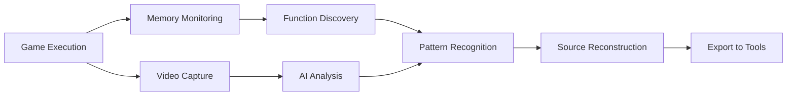

# PCSX2 Analysis Framework

## Overview

The PCSX2 Analysis Framework is a comprehensive system that integrates advanced analysis capabilities directly into the PCSX2 PlayStation 2 emulator. It provides native support for Model Context Protocol (MCP) servers, CheatEngine-compatible memory analysis, IDA Pro integration, and Ghidra analyzer support.

## Features

### Core Framework
- **Unified API**: Consistent interface for all analysis tools
- **Event-Driven Architecture**: Real-time notifications for memory access, breakpoints, and state changes
- **Plugin System**: Modular design allowing easy extension and customization
- **Thread-Safe Operations**: Safe concurrent access to emulator state
- **Minimal Performance Impact**: Designed to not interfere with emulation performance

### Enhanced Source Reconstruction (NEW)
- **Real-Time Function Discovery**: Automatically identify and analyze functions during gameplay
- **Microprogram Pattern Detection**: Detect asset decompression, ELF loading, and other microprogram activities
- **Gameplay Correlation**: Correlate memory operations with visual gameplay context
- **AI-Assisted Analysis**: Generate intelligent function names and purposes using AI integration
- **Behavioral Pattern Recognition**: Identify function types based on execution patterns and memory access

### MCP Server Integration
- **JSON-RPC 2.0 Protocol**: Standard Model Context Protocol implementation
- **Real-Time State Access**: Live monitoring of emulator state
- **AI-Assisted Analysis**: Compatible with AI tools and language models
- **Tool Discovery**: Automatic discovery and documentation of available analysis tools
- **WebSocket Support**: Real-time bidirectional communication
- **Enhanced Tool Set**: 25+ specialized tools for comprehensive analysis

### Multimodal AI Integration (NEW)
- **Video Frame Analysis**: Submit gameplay video frames for AI analysis
- **Cross-Modal Correlation**: Correlate visual gameplay with memory operations
- **Real-Time Context Detection**: Automatically detect gameplay context (menu, combat, etc.)
- **AI Prompt Generation**: Automatically generate prompts for function analysis
- **Claude & Gemini Support**: Native integration with leading AI models

### Enhanced Memory Analysis
- **Safe Memory Access**: Protected read/write operations through PCSX2's memory system
- **Pattern Scanning**: Advanced memory scanning with mask support
- **Value Monitoring**: Real-time tracking of memory value changes
- **CheatEngine Compatibility**: Native support for CheatEngine-style memory manipulation
- **Memory Region Validation**: Automatic validation of PS2 memory regions
- **Function Pattern Detection**: Identify common game patterns (health, position, score, etc.)

### External Tool Integration

#### IDA Pro Interface
- **Symbol Management**: Import/export symbols between PCSX2 and IDA Pro
- **Function Analysis**: Automatic function detection and analysis
- **Cross-Reference Generation**: Build comprehensive code cross-references
- **Python Script Generation**: Automated IDA Pro script creation
- **PS2 ELF Support**: Native PlayStation 2 ELF file handling
- **Enhanced Export**: Export discovered functions with AI-generated names

#### Ghidra Analyzer
- **Memory Dump Export**: Export PS2 memory for Ghidra analysis
- **Custom Processor Support**: PS2 MIPS R5900 processor module
- **Project Management**: Automated Ghidra project creation and configuration
- **Decompilation Support**: Integration with Ghidra's decompiler
- **Python Script Generation**: Automated analysis script creation
- **Source Reconstruction Export**: Export function analysis results

### Debug Integration
- **Breakpoint Management**: Advanced breakpoint system integration
- **Register Access**: Complete access to PS2 CPU registers
- **Execution Control**: Pause, resume, and step-through functionality
- **Disassembly Integration**: Native PS2 MIPS disassembly support
- **Real-Time Monitoring**: Continuous analysis during game execution

## Enhanced Analysis Workflow

### Real-Time Source Reconstruction During Gameplay

The enhanced Analysis Framework now supports autonomous source code reconstruction by analyzing gameplay patterns in real-time:



### Multimodal AI Integration Workflow

1. **Gameplay Monitoring**: Continuous monitoring of PS2 game execution
2. **Function Discovery**: Real-time identification of active functions
3. **Video Analysis**: AI-powered analysis of gameplay video frames
4. **Cross-Modal Correlation**: Correlation between visual gameplay and memory operations
5. **Pattern Recognition**: Identification of function purposes based on behavioral patterns
6. **AI-Assisted Naming**: Automatic generation of descriptive function names
7. **Export Integration**: Seamless export to IDA Pro, Ghidra, and other tools

### Example: Automatic Function Discovery

```python
# Connect to enhanced PCSX2
client = EnhancedPCSX2Client()
client.connect()

# Start real-time analysis
client.start_realtime_analysis()

# Set gameplay context for AI correlation
client.set_gameplay_context("combat")

# AI analyzes video and correlates with memory
client.start_video_monitoring()

# After gameplay session, get discovered functions
functions = client.get_discovered_functions()

# Export to reverse engineering tools
client.export_analysis_results("ida", "auto_discovered_functions.py")
client.export_analysis_results("ghidra", "auto_discovered_functions_ghidra.py")
```

## Architecture

### Directory Structure
```
pcsx2/AnalysisFramework/
├── Core/                           # Core framework components
│   ├── AnalysisFramework.*         # Main framework manager
│   ├── MemoryInterface.*           # Memory access abstraction
│   └── DebugInterface.*            # Debug system integration
├── MCPServer/                      # Enhanced Model Context Protocol implementation
│   └── MCPServer.*                 # MCP server with 25+ analysis tools
├── SourceReconstruction/           # NEW: Real-time source code reconstruction
│   └── SourceReconstruction.*      # Function discovery and AI analysis
├── CheatEngine/                    # Enhanced memory scanning and modification
│   ├── CheatEngine.h               # Header with pattern detection structures
│   └── CheatEngine.cpp             # NEW: Full implementation with game patterns
├── IDAInterface/                   # Enhanced IDA Pro integration
│   └── IDAInterface.*              # Symbol export with AI-generated names
├── GhidraAnalyzer/                 # Enhanced Ghidra integration
│   └── GhidraAnalyzer.*            # Memory export with source reconstruction
├── Common/                         # Shared utilities and helpers
│   └── Utilities.*                 # Analysis utilities and patterns
└── examples/                       # Usage examples and AI integration
    ├── mcp_client_example.py       # Basic MCP client
    ├── enhanced_mcp_client.py      # NEW: Enhanced client with AI features
    └── AI_INTEGRATION_GUIDE.md     # NEW: Comprehensive AI integration guide
```

### Core Components

#### AnalysisFrameworkCore
Central manager that coordinates all analysis modules and provides:
- Module registration and lifecycle management
- Event system for inter-module communication
- Interface access to memory and debug systems
- Configuration and state management

#### IMemoryInterface
Provides safe, validated access to PS2 emulated memory:
- Read/write operations with bounds checking
- Pattern scanning with configurable masks
- Memory region validation
- Value type conversion utilities

#### IDebugInterface
Integrates with PCSX2's existing debug infrastructure:
- Breakpoint management
- Register access (GPR, special registers)
- Execution control
- Disassembly services

## Usage Examples

### MCP Protocol Usage

#### Tool Discovery
```json
{
  "jsonrpc": "2.0",
  "method": "tools/list",
  "id": 1
}
```

Response:
```json
{
  "jsonrpc": "2.0",
  "result": {
    "tools": [
      {
        "name": "read_memory",
        "description": "Read memory from PS2 emulated system",
        "inputSchema": {
          "type": "object",
          "properties": {
            "address": {"type": "string"},
            "size": {"type": "number"}
          }
        }
      }
    ]
  },
  "id": 1
}
```

#### Memory Reading
```json
{
  "jsonrpc": "2.0",
  "method": "tools/call",
  "params": {
    "name": "read_memory",
    "arguments": {
      "address": "0x00100000",
      "size": 256
    }
  },
  "id": 2
}
```

#### Performance Monitoring
```json
{
  "jsonrpc": "2.0",
  "method": "tools/call",
  "params": {
    "name": "get_performance_metrics",
    "arguments": {}
  },
  "id": 3
}
```

### IDA Pro Integration

#### Symbol Export
```cpp
// Create IDA interface
auto idaInterface = std::make_shared<AnalysisFramework::IDAInterface>();
idaInterface->Initialize();

// Add symbols
AnalysisFramework::SymbolInfo symbol;
symbol.address = 0x00100000;
symbol.name = "main_function";
symbol.type = "function";
symbol.size = 256;
idaInterface->AddSymbol(symbol);

// Export to IDA script
idaInterface->ExportToIDADatabase("ps2_game_analysis");
```

Generated IDA Python script:
```python
import ida_name
import ida_funcs

def apply_pcsx2_analysis():
    print("Applying PCSX2 analysis results...")
    
    # Function: main_function
    ida_funcs.add_func(0x00100000)
    ida_name.set_name(0x00100000, "main_function")
    
    ida_auto.auto_wait()
    print("PCSX2 analysis applied successfully!")

apply_pcsx2_analysis()
```

### Ghidra Integration

#### Memory Export
```cpp
// Create Ghidra analyzer
auto ghidraAnalyzer = std::make_shared<AnalysisFramework::GhidraAnalyzer>();
ghidraAnalyzer->Initialize();

// Export memory dump
ghidraAnalyzer->ExportFullMemoryImage("ps2_memory_dump.bin");

// Generate analysis configuration
AnalysisFramework::GhidraAnalysisConfig config;
config.enableDecompiler = true;
config.enableFunctionAnalysis = true;
ghidraAnalyzer->GenerateGhidraScript("ps2_analysis.py", config);
```

Generated Ghidra Python script:
```python
from ghidra.app.script import GhidraScript

class PCSX2AnalysisScript(GhidraScript):
    def run(self):
        print("Running PCSX2 analysis on PS2 program...")
        
        # Set up PS2 memory map
        self.setup_ps2_memory_map()
        
        # Enable function analysis
        self.analyzeProgram()
        
    def setup_ps2_memory_map(self):
        memory = currentProgram.getMemory()
        # Main memory: 0x00000000-0x01FFFFFF (32MB)
        # Scratchpad: 0x70000000-0x70003FFF (16KB)
```

### Framework Integration

#### Module Registration
```cpp
// Get framework core
auto& core = AnalysisFramework::AnalysisFrameworkCore::GetInstance();
core.Initialize();

// Register modules
auto mcpServer = std::make_shared<AnalysisFramework::MCPServer>();
auto idaInterface = std::make_shared<AnalysisFramework::IDAInterface>();
auto ghidraAnalyzer = std::make_shared<AnalysisFramework::GhidraAnalyzer>();

core.RegisterModule(mcpServer);
core.RegisterModule(idaInterface);
core.RegisterModule(ghidraAnalyzer);

// Start MCP server
mcpServer->StartServer();
```

#### Event Handling
```cpp
// Register for memory events
core.RegisterEventCallback(AnalysisFramework::AnalysisEvent::MemoryWrite,
    [](AnalysisFramework::AnalysisEvent event, const void* data, size_t size) {
        if (data && size >= sizeof(u32)) {
            u32 address = *static_cast<const u32*>(data);
            Console.WriteLn("Memory write detected at 0x%08X", address);
        }
    });
```

## Configuration

### Framework Settings
The Analysis Framework can be configured through PCSX2's existing configuration system:

```ini
[AnalysisFramework]
Enabled=true
MCPServerPort=28011
EnableIDAIntegration=true
EnableGhidraIntegration=true
MemoryScanningEnabled=true
```

### MCP Server Configuration
```ini
[MCPServer]
Port=28011
EnableRealTimeUpdates=true
MaxMemoryScanResults=10000
```

## Performance Considerations

### Memory Access
- All memory operations go through PCSX2's validated memory system
- Bulk operations use chunked reading to avoid large allocations
- Memory scanning includes safety limits to prevent performance impact

### Event System
- Events are processed asynchronously where possible
- Event callbacks are designed to be lightweight
- Framework can be disabled entirely if not needed

### Module Loading
- Modules are loaded on-demand
- Unused modules have minimal memory footprint
- External tool integration is optional and configurable

## Development

### Adding New Modules
To create a new analysis module:

1. Inherit from `IAnalysisModule`:
```cpp
class MyAnalysisModule : public AnalysisFramework::IAnalysisModule
{
public:
    const std::string& GetModuleId() const override { return m_moduleId; }
    const std::string& GetModuleName() const override { return m_moduleName; }
    const std::string& GetModuleVersion() const override { return m_moduleVersion; }
    
    bool Initialize() override;
    void Shutdown() override;
    bool IsInitialized() const override;
    
    void OnFrameworkEvent(AnalysisEvent event, const void* data, size_t size) override;
};
```

2. Register with the framework:
```cpp
auto module = std::make_shared<MyAnalysisModule>();
AnalysisFrameworkCore::GetInstance().RegisterModule(module);
```

### Testing
The framework includes comprehensive unit tests:
```bash
cd build
make core_test
./tests/ctest/core/core_test --gtest_filter="AnalysisFramework*"
```

## Dependencies

### Required
- RapidJSON (already available in PCSX2)
- PCSX2's existing DebugTools infrastructure
- PCSX2's memory management system

### Optional
- IDA Pro (for IDA integration features)
- Ghidra (for Ghidra integration features)
- External MCP clients (for AI-assisted analysis)

## Future Enhancements

### Planned Features
- CheatEngine module implementation completion
- Additional MCP tools and capabilities
- GUI integration for visual analysis tools
- Extended PS2 processor definitions for external tools
- Real-time collaborative analysis features

### Extension Points
- Custom analysis algorithms
- Additional external tool integrations
- Specialized PS2 game analysis modules
- Performance profiling and optimization tools

## License

This Analysis Framework is part of PCSX2 and is licensed under the same GPL-3.0+ license as the main project.

## Contributing

Contributions to the Analysis Framework are welcome! Please follow PCSX2's existing contribution guidelines and ensure all new code includes appropriate unit tests.

## Support

For issues related to the Analysis Framework, please:
1. Check the existing PCSX2 documentation
2. Review the test cases for usage examples
3. Submit issues through PCSX2's normal issue reporting process